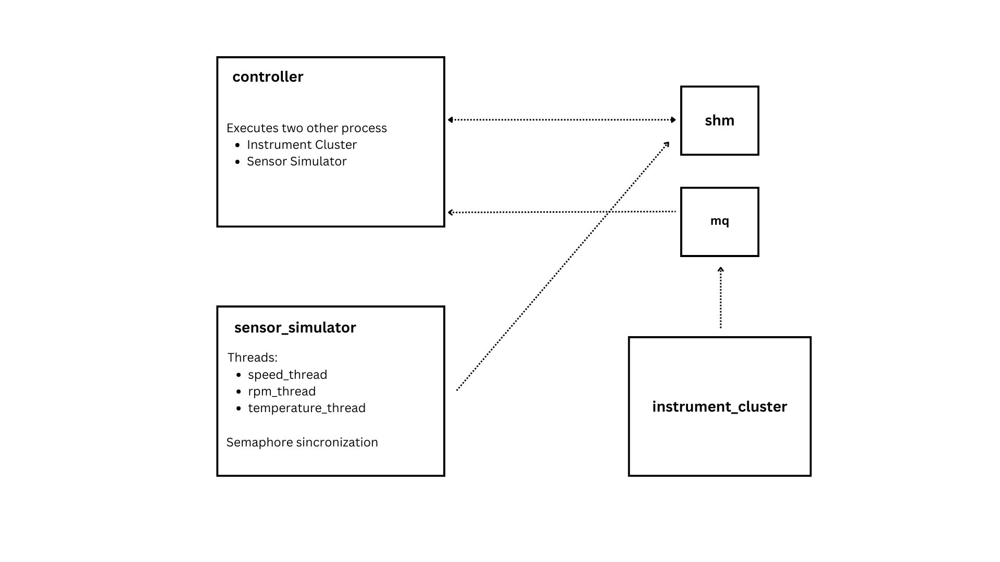

# testenv_posix

Projeto do ambiente de testes automotivos. Este README tem por finalidade descrever a arquitetura do sistema.

## Arquitetura

Abaixo podemos observar uma imagem ilustrativa do design do sistema:

Os mecanismos de Comunicação Interprocessual (IPC), como memória compartilhada, filas de mensagens e semáforos, são empregados para coordenar o funcionamento dos processos. A memória compartilhada é utilizada para a comunicação entre os processos `sensor_simulator`, que escreve na memória, e `controller`, que faz a leitura da memória. A fila de mensagem, por sua vez, é utilizada entre `instrument_cluster` e `controller`. O semáforo é utilizado para gerenciar recursos utilizados pelas threads do `sensor_simulator`.

### **Processos**

O sistema contém três processos: controlador, processo principal e que dá origem aos demais, painel de instrumentos e simulador de sensores. Abaixo adicionarei mais detalhes acerca do funcionamento de cada um deles.

#### **Controlador**

Esse é o processo principal o qual gerencia a comunicação e execução dos demais processos. Aqui vale destacar a implementação do tratamento dos sinais de usuário SIGUSR1,para pausar o processo do controlador, SIGUSR2, para encerrar o programa, e o sinal de sistema SIGINT, que também encerra os processos. É também no controlador que a fila de mensagens e memória compartilhada são criadas e mapeadas, e a interface de display é gerenciada.

#### **Painel de Instrumentos**

Esse é o processo que capta os comandos do usuário e os escreve na fila de mensagens.

#### **Simulador de Sensores**

Esse processo simula três sensores automotivos com valores randômicos, cada um rodando em uma thread separada:
- Velocidade: varia entre 10 a 190 km/h
- Rotação do motor: varia entre 1000 e 8000 RPM
- Temperatura: varia entre 75 e 105 °C
Cada thread ajusta o valor do sensor e escreve na memória compartilhada, permitindo que o Controlador possa ler os valores gerados. Também é válido destacar que esse processo utiliza um semáforo para garantir que apenas uma thread acesse a memória compartilhada por vez.